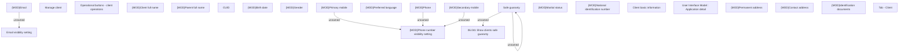

# Tab - Client

```mermaid
graph TD
    Email_visibility_setting["Email visibility setting"]
    MOD_Phone_number_visibility_setting["{MOD}Phone number visibility setting"]
    Safe_guaranty["Safe guaranty"]
    n_06_041_Show_clients_safe_guaranty["06.041 Show clients safe guaranty"]
    Safe_guaranty["Safe guaranty"]
    Manage_client["Manage client"]
    Operational_buttons_client_operations["Operational buttons - client operations"]
    MOD_Client_full_name["{MOD}Client full name"]
    MOD_Parent_full_name["{MOD}Parent full name"]
    CUID["CUID"]
    MOD_Birth_date["{MOD}Birth date"]
    MOD_Gender["{MOD}Gender"]
    MOD_Email["{MOD}Email"]
    MOD_Preferred_language["{MOD}Preferred language"]
    MOD_Primary_mobile["{MOD}Primary mobile"]
    MOD_Phone["{MOD}Phone"]
    MOD_Secondary_mobile["{MOD}Secondary mobile"]
    MOD_Marital_status["{MOD}Marital status"]
    MOD_National_identification_number["{MOD}National identification number"]
    Client_basic_information["Client basic information"]
    User_Interface_Model_Application_detail["User Interface Model : Application detail"]
    MOD_Permanent_address["{MOD}Permanent address"]
    MOD_Contact_address["{MOD}Contact address"]
    MOD_Identification_documents["{MOD}Identification documents"]
    Tab_Client["Tab - Client"]
    Safe_guaranty -->|unnamed| n_06_041_Show_clients_safe_guaranty
    Safe_guaranty -->|unnamed| Safe_guaranty
    MOD_Primary_mobile -->|unnamed| MOD_Phone_number_visibility_setting
    MOD_Phone -->|unnamed| MOD_Phone_number_visibility_setting
    MOD_Secondary_mobile -->|unnamed| MOD_Phone_number_visibility_setting
    MOD_Email -->|unnamed| Email_visibility_setting
```
