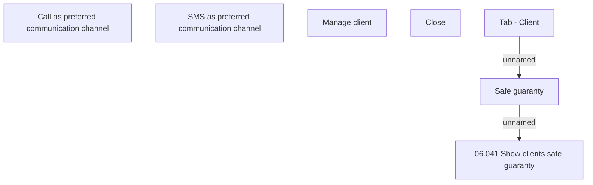

# Safe guaranty

- **Diagram Type**: Custom
- **Package**: HomerSelect/BSL/Analysis Model/Contract Origination/Application detail/User Interface Model/Tab - Client/Safe guaranty
- **Diagram ID**: 149839
- **Elements**: 9
- **Connectors**: 2

