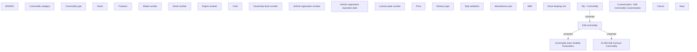

# Edit commodity

```mermaid
graph TD
    MSISDN["MSISDN"]
    n_01_650_Edit_Contract_Commodity["01.650 Edit Contract Commodity"]
    Commodity_category["Commodity category"]
    Commodity_type["Commodity type"]
    Name["Name"]
    Producer["Producer"]
    Model_number["Model number"]
    Serial_number["Serial number"]
    Engine_number["Engine number"]
    Color["Color"]
    Ownership_book_number["Ownership book number"]
    Vehicle_registration_number["Vehicle registration number"]
    Vehicle_registration_expiration_date["Vehicle registration expiration date"]
    License_plate_number["License plate number"]
    Price["Price"]
    Delivery_type["Delivery type"]
    Skip_validation["Skip validation"]
    Manufacture_year["Manufacture year"]
    IMEI["IMEI"]
    Stock_keeping_unit["Stock keeping unit"]
    Edit_commodity["Edit commodity"]
    Tab_Commodity["Tab - Commodity"]
    Customization_Edit_Commodity_Customization["Customization : Edit Commodity Customization"]
    Commodity_Data_Visibility_Parameters["Commodity Data Visibility Parameters"]
    Cancel["Cancel"]
    Save["Save"]
    Edit_commodity["Edit commodity"]
    Tab_Commodity -->|unnamed| Edit_commodity
    Edit_commodity -->|unnamed| Commodity_Data_Visibility_Parameters
    Edit_commodity -->|unnamed| n_01_650_Edit_Contract_Commodity
```
