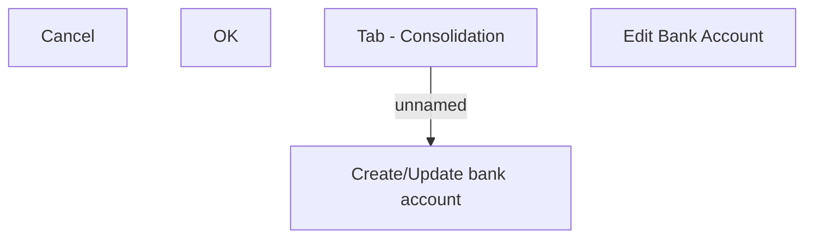

# Create/Update bank account

- **Diagram Type**: Custom
- **Package**: HomerSelect/BSL/Analysis Model/Contract Origination/Application detail/User Interface Model/Tab - Consolidation/Create/Update bank account (modal window)
- **Diagram ID**: 131368
- **Elements**: 5
- **Connectors**: 1

