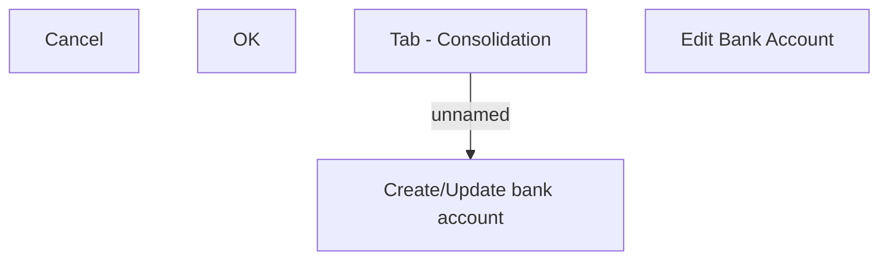

# Create/Update bank account

```mermaid
graph TD
    Cancel["Cancel"]
    OK["OK"]
    Tab_Consolidation["Tab - Consolidation"]
    Edit_Bank_Account["Edit Bank Account"]
    Create_Update_bank_account["Create/Update bank account"]
    Tab_Consolidation -->|unnamed| Create_Update_bank_account
```
