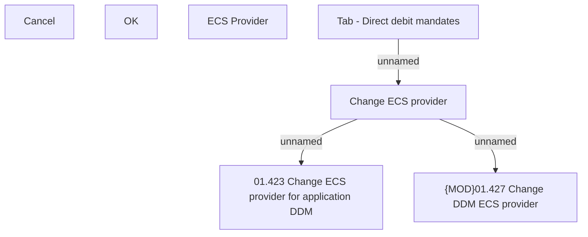

# Change ECS provider

- **Diagram Type**: Custom
- **Package**: HomerSelect/BSL/Analysis Model/Contract Origination/Application detail/User Interface Model/Tab - Direct debit mandates/Change ECS provider (modal window)
- **Diagram ID**: 158052
- **Elements**: 8
- **Connectors**: 3

