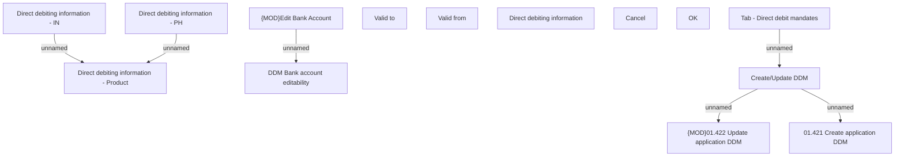

# Create/Update DDM

```mermaid
graph TD
    n_01_421_Create_application_DDM["01.421 Create application DDM"]
    MOD_01_422_Update_application_DDM["{MOD}01.422 Update application DDM"]
    Direct_debiting_information_Product["Direct debiting information - Product"]
    Direct_debiting_information_PH["Direct debiting information - PH"]
    Direct_debiting_information_IN["Direct debiting information - IN"]
    DDM_Bank_account_editability["DDM Bank account editability"]
    MOD_Edit_Bank_Account["{MOD}Edit Bank Account"]
    Valid_to["Valid to"]
    Valid_from["Valid from"]
    Direct_debiting_information["Direct debiting information"]
    Cancel["Cancel"]
    OK["OK"]
    Create_Update_DDM["Create/Update DDM"]
    Tab_Direct_debit_mandates["Tab - Direct debit mandates"]
    Create_Update_DDM["Create/Update DDM"]
    Tab_Direct_debit_mandates -->|unnamed| Create_Update_DDM
    MOD_Edit_Bank_Account -->|unnamed| DDM_Bank_account_editability
    Direct_debiting_information_IN -->|unnamed| Direct_debiting_information_Product
    Direct_debiting_information_PH -->|unnamed| Direct_debiting_information_Product
    Create_Update_DDM -->|unnamed| MOD_01_422_Update_application_DDM
    Create_Update_DDM -->|unnamed| n_01_421_Create_application_DDM
```
