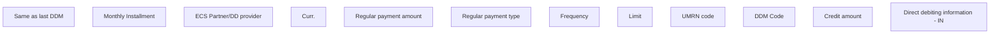

# Direct debiting information - IN

```mermaid
graph TD
    Same_as_last_DDM["Same as last DDM"]
    Monthly_Installment["Monthly Installment"]
    ECS_Partner_DD_provider["ECS Partner/DD provider"]
    Curr["Curr."]
    Regular_payment_amount["Regular payment amount"]
    Regular_payment_type["Regular payment type"]
    Frequency["Frequency"]
    Curr["Curr."]
    Limit["Limit"]
    UMRN_code["UMRN code"]
    DDM_Code["DDM Code"]
    Credit_amount["Credit amount"]
    Direct_debiting_information_IN["Direct debiting information - IN"]
```
