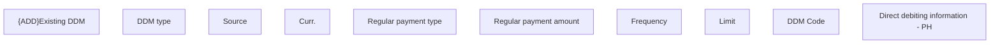

# Direct debiting information - PH

```mermaid
graph TD
    ADD_Existing_DDM["{ADD}Existing DDM"]
    DDM_type["DDM type"]
    Source["Source"]
    Curr["Curr."]
    Regular_payment_type["Regular payment type"]
    Regular_payment_amount["Regular payment amount"]
    Frequency["Frequency"]
    Curr["Curr."]
    Limit["Limit"]
    DDM_Code["DDM Code"]
    Direct_debiting_information_PH["Direct debiting information - PH"]
```
