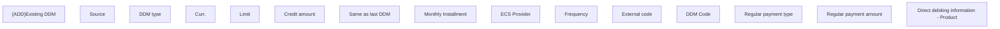

# Direct debiting information - Product

```mermaid
graph TD
    ADD_Existing_DDM["{ADD}Existing DDM"]
    Source["Source"]
    DDM_type["DDM type"]
    Curr["Curr."]
    Curr["Curr."]
    Limit["Limit"]
    Credit_amount["Credit amount"]
    Same_as_last_DDM["Same as last DDM"]
    Monthly_Installment["Monthly Installment"]
    ECS_Provider["ECS Provider"]
    Frequency["Frequency"]
    External_code["External code"]
    DDM_Code["DDM Code"]
    Regular_payment_type["Regular payment type"]
    Regular_payment_amount["Regular payment amount"]
    Direct_debiting_information_Product["Direct debiting information - Product"]
```
