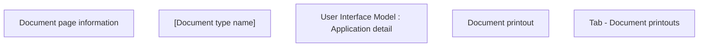

# Tab - Document printouts

- **Diagram Type**: Custom
- **Package**: HomerSelect/BSL/Analysis Model/Contract Origination/Application detail/User Interface Model/Tab - Document printouts
- **Diagram ID**: 139533
- **Elements**: 5
- **Connectors**: 0

