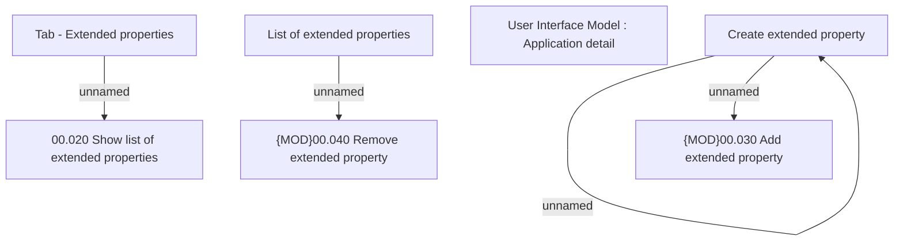

# Tab - Extended properties

- **Diagram Type**: Custom
- **Package**: HomerSelect/BSL/Analysis Model/Contract Origination/Application detail/User Interface Model/Tab - Extended properties
- **Diagram ID**: 127760
- **Elements**: 8
- **Connectors**: 4

