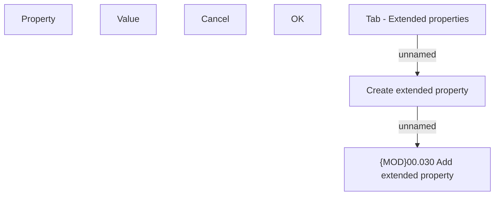

# Create extended property

- **Diagram Type**: Custom
- **Package**: HomerSelect/BSL/Analysis Model/Contract Origination/Application detail/User Interface Model/Tab - Extended properties/Create extended property
- **Diagram ID**: 127811
- **Elements**: 8
- **Connectors**: 2

