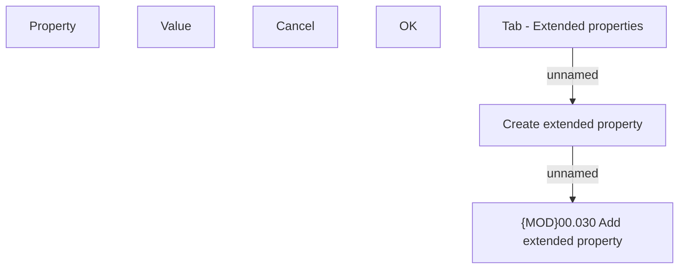

# Create extended property

```mermaid
graph TD
    MOD_00_030_Add_extended_property["{MOD}00.030 Add extended property"]
    Property["Property"]
    Value["Value"]
    Create_extended_property["Create extended property"]
    Cancel["Cancel"]
    OK["OK"]
    Create_extended_property["Create extended property"]
    Tab_Extended_properties["Tab - Extended properties"]
    Create_extended_property -->|unnamed| MOD_00_030_Add_extended_property
    Tab_Extended_properties -->|unnamed| Create_extended_property
```
