# Tab - Payment channels

- **Diagram Type**: Custom
- **Package**: HomerSelect/BSL/Analysis Model/Contract Origination/Application detail/User Interface Model/Tab - Payment channels
- **Diagram ID**: 162145
- **Elements**: 69
- **Connectors**: 4

```mermaid
graph TD
    Show_address["Show address"]
    Document_number["Document number"]
    Phone_number_1["Phone number 1"]
    Name_1["Name 1"]
    Name_3["Name 3"]
    Name_2["Name 2"]
    ADD_Beneficiary_address["{ADD}Beneficiary address"]
    ADD_Beneficiary_person["{ADD}Beneficiary person"]
    ADD_Target_type["{ADD}Target type"]
    Change_disbursement_channel["Change disbursement channel"]
    n_01_659_Change_application_repayment_payment_channel["01.659 Change application repayment payment channel"]
    MOD_01_661_Change_application_disbursement_payment_channel["{MOD}01.661 Change application disbursement payment channel"]
    Change_reward_payment_channel["Change reward payment channel"]
    Change_repayment_channel["Change repayment channel"]
    Interest_rates["Interest rates"]
    Presented_Interest_Rate["Presented Interest Rate"]
    Repayment_channel["Repayment channel"]
    Show_disbursement_channel_change_request_UI["Show disbursement channel change request - UI"]
    Disbursement_channel["Disbursement channel"]
    Show_disbursement_channel_change_request["Show disbursement channel change request"]
    Change_disbursement_channel["Change disbursement channel"]
    Change_reward_payment_channel["Change reward payment channel"]
    CEL_reward_channel["CEL reward channel"]
    Operational_buttons_CEL_reward_channel_operations["Operational buttons - CEL reward channel operations"]
    Operational_buttons_disbursement_channel_operations["Operational buttons - disbursement channel operations"]
    Change_repayment_channel["Change repayment channel"]
    User_Interface_Model_Application_detail["User Interface Model : Application detail"]
    Truncated_PAN["Truncated PAN"]
    Card_issuer_name["Card issuer name"]
    n_01_669_Change_reward_payment_channel["01.669 Change reward payment channel"]
    Type["Type"]
    Bank_code["Bank code"]
    Bank_account_number["Bank account number"]
    n_01_664_Show_disbursement_channel_change_request["01.664 Show disbursement channel change request"]
    Partner_bank_branch["Partner bank branch"]
    Partner["Partner "]
    Min_installment_fixed_amount["Min installment fixed amount"]
    Min_installment_rate["Min installment rate"]
    Min_installment_base["Min installment base"]
    Presented_interest_rate_from_initial_transaction["Presented interest rate from initial transaction"]
    Presented_interest_rate_from_extra_transaction["Presented interest rate from extra transaction"]
    Down_payment_amount["Down payment amount"]
    Cash_payment["Cash payment"]
    Customer_first_due_date["Customer first due date"]
    Credit_amount["Credit amount"]
    First_due_date["First due date"]
    Show_Bank_Account["Show Bank Account"]
    Fees_and_services["Fees and services"]
    Credit_limit["Credit limit"]
    Installments_without_advance_EMI["Installments without advance EMI"]
    Total_payment_per_credit["Total payment per credit"]
    Annuity["Annuity"]
    Monthly_installment["Monthly installment"]
    Installment_schedule_type["Installment schedule type"]
    Annual_interest_rate["Annual interest rate"]
    Marketing_actions["Marketing actions"]
    Repayment_channel["Repayment channel"]
    Product_name["Product name"]
    Disbursement_channel["Disbursement channel"]
    CEL_reward_channel["CEL reward channel"]
    External_payment_card_information["External payment card information"]
    Payment_provider_information["Payment provider information"]
    Disbursement_channel["Disbursement channel"]
    Operational_buttons_repayment_channel_operations["Operational buttons - repayment channel operations"]
    Close_end_loan_information_basic_product_offer_information["Close-end loan information - basic product offer information"]
    Close_end_loan_information_financial_parameters["Close-end loan information - financial parameters"]
    Credit_card_loan_information["Credit card loan information"]
    Repayment_channel["Repayment channel"]
    Tab_Payment_channels["Tab - Payment channels"]
    Show_disbursement_channel_change_request -->|unnamed| n_01_664_Show_disbursement_channel_change_request
    Change_reward_payment_channel -->|unnamed| n_01_669_Change_reward_payment_channel
    Change_disbursement_channel -->|unnamed| MOD_01_661_Change_application_disbursement_payment_channel
    Change_repayment_channel -->|unnamed| n_01_659_Change_application_repayment_payment_channel
```

