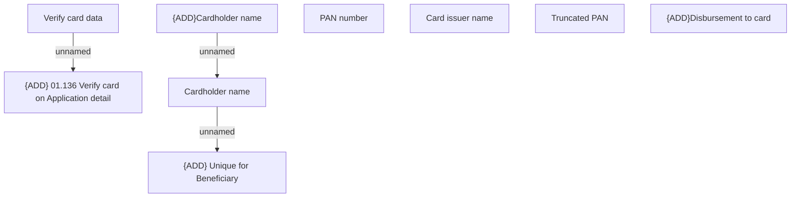

# Card account selection on Application detail

- **Diagram Type**: Custom
- **Package**: HomerSelect/BSL/Analysis Model/Contract Origination/Application detail/User Interface Model/Tab - Payment channels/Change disbursement channel (modal window)
- **Diagram ID**: 158306
- **Elements**: 9
- **Connectors**: 3

