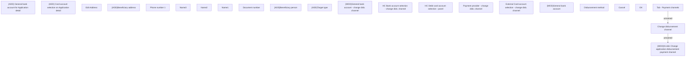

# Change disbursement channel

```mermaid
graph TD
    ADD_General_bank_account_for_Application_detail["{ADD} General bank account for Application detail"]
    ADD_Card_account_selection_on_Application_detail["{ADD} Card account selection on Application detail"]
    Edit_Address["Edit Address"]
    ADD_Beneficiary_address["{ADD}Beneficiary address"]
    Phone_number_1["Phone number 1"]
    Name3["Name3"]
    Name2["Name2"]
    Name1["Name1"]
    Document_number["Document number"]
    ADD_Beneficiary_person["{ADD}Beneficiary person"]
    ADD_Target_type["{ADD}Target type"]
    MOD_General_bank_account_change_disb_channel["{MOD}General bank account - change disb. channel"]
    HC_Bank_account_selection_change_disb_channel["HC Bank account selection - change disb. channel"]
    HC_Debit_card_account_selection_panel["HC Debit card account selection - panel"]
    Payment_provider_change_disb_channel["Payment provider - change disb. channel"]
    External_Card_account_selection_change_disb_channel["External Card account selection - change disb. channel"]
    MOD_General_bank_account["{MOD}General bank account"]
    Disbursement_method["Disbursement method"]
    Change_disbursement_channel["Change disbursement channel"]
    Cancel["Cancel"]
    OK["OK"]
    Tab_Payment_channels["Tab - Payment channels"]
    MOD_01_661_Change_application_disbursement_payment_channel["{MOD}01.661 Change application disbursement payment channel"]
    Change_disbursement_channel["Change disbursement channel"]
    Tab_Payment_channels -->|unnamed| Change_disbursement_channel
    Change_disbursement_channel -->|unnamed| MOD_01_661_Change_application_disbursement_payment_channel
```
