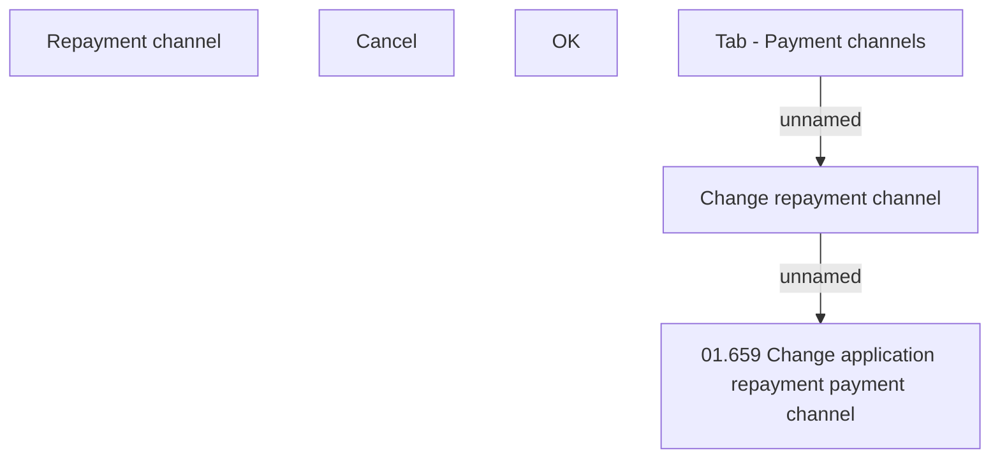

# Change repayment channel

- **Diagram Type**: Custom
- **Package**: HomerSelect/BSL/Analysis Model/Contract Origination/Application detail/User Interface Model/Tab - Payment channels/Change repayment channel (modal window)
- **Diagram ID**: 151073
- **Elements**: 7
- **Connectors**: 2

