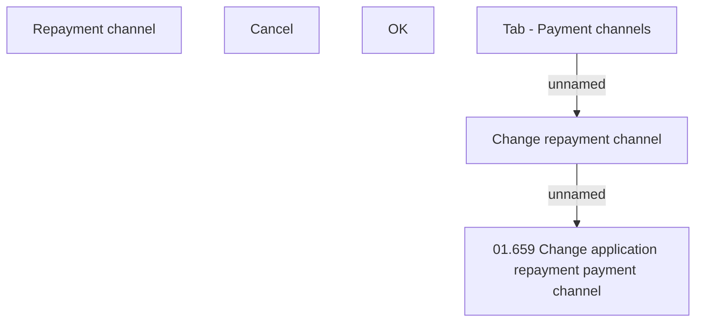

# Change repayment channel

```mermaid
graph TD
    n_01_659_Change_application_repayment_payment_channel["01.659 Change application repayment payment channel"]
    Repayment_channel["Repayment channel"]
    Cancel["Cancel"]
    OK["OK"]
    Change_repayment_channel["Change repayment channel"]
    Change_repayment_channel["Change repayment channel"]
    Tab_Payment_channels["Tab - Payment channels"]
    Tab_Payment_channels -->|unnamed| Change_repayment_channel
    Change_repayment_channel -->|unnamed| n_01_659_Change_application_repayment_payment_channel
```
