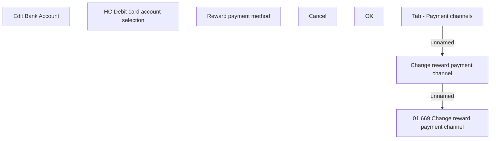

# Change reward payment channel

```mermaid
graph TD
    Edit_Bank_Account["Edit Bank Account"]
    HC_Debit_card_account_selection["HC Debit card account selection"]
    Reward_payment_method["Reward payment method"]
    Change_reward_payment_channel["Change reward payment channel"]
    Cancel["Cancel"]
    OK["OK"]
    n_01_669_Change_reward_payment_channel["01.669 Change reward payment channel"]
    Change_reward_payment_channel["Change reward payment channel"]
    Tab_Payment_channels["Tab - Payment channels"]
    Tab_Payment_channels -->|unnamed| Change_reward_payment_channel
    Change_reward_payment_channel -->|unnamed| n_01_669_Change_reward_payment_channel
```
