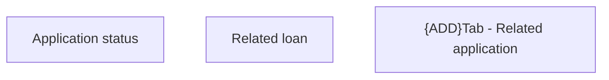

# Tab - Related application

- **Diagram Type**: Custom
- **Package**: HomerSelect/BSL/Analysis Model/Contract Origination/Application detail/User Interface Model/Tab - Related application
- **Diagram ID**: 156943
- **Elements**: 3
- **Connectors**: 0

