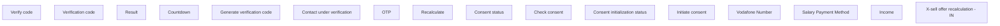

# India

```mermaid
graph TD
    Verify_code["Verify code"]
    Verification_code["Verification code"]
    Result["Result"]
    Countdown["Countdown"]
    Generate_verification_code["Generate verification code"]
    Contact_under_verification["Contact under verification"]
    OTP["OTP"]
    Recalculate["Recalculate"]
    Consent_status["Consent status"]
    Check_consent["Check consent"]
    Consent_initialization_status["Consent initialization status"]
    Initiate_consent["Initiate consent"]
    Vodafone_Number["Vodafone Number"]
    Salary_Payment_Method["Salary Payment Method"]
    Income["Income"]
    X_sell_offer_recalculation_IN["X-sell offer recalculation - IN"]
```
