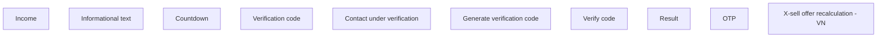

# Vietnam

- **Diagram Type**: Custom
- **Package**: HomerSelect/BSL/Analysis Model/Contract Origination/Application detail/User Interface Model/X-sell offer recalculation/Vietnam
- **Diagram ID**: 137853
- **Elements**: 10
- **Connectors**: 0

