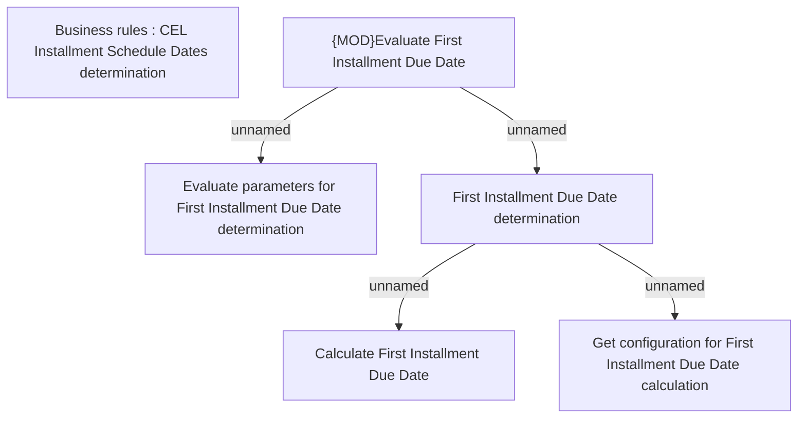

# First Installment Due Date for Application/Contract

- **Diagram Type**: Custom
- **Package**: HomerSelect/BSL/Analysis Model/Contract Origination/COMMON for Contract origination/Business Rules
- **Diagram ID**: 164377
- **Elements**: 6
- **Connectors**: 4

