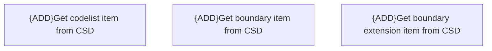

# Operations with CSD codelists

- **Diagram Type**: Custom
- **Package**: HomerSelect/BSL/Analysis Model/Contract Origination/COMMON for Contract origination/Business Rules/Operations with CSD codelists
- **Diagram ID**: 164383
- **Elements**: 3
- **Connectors**: 0

