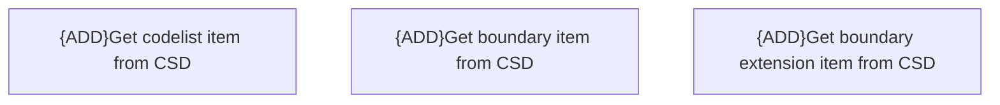

# Operations with CSD codelists

```mermaid
graph TD
    ADD_Get_codelist_item_from_CSD["{ADD}Get codelist item from CSD"]
    ADD_Get_boundary_item_from_CSD["{ADD}Get boundary item from CSD"]
    ADD_Get_boundary_extension_item_from_CSD["{ADD}Get boundary extension item from CSD"]
```
