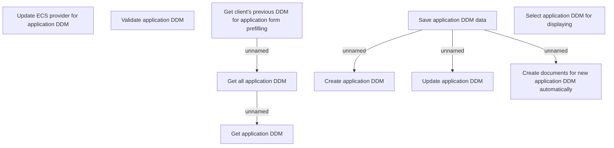

# Operations with application DDM

```mermaid
graph TD
    Create_documents_for_new_application_DDM_automatically["Create documents for new application DDM automatically"]
    Update_ECS_provider_for_application_DDM["Update ECS provider for application DDM"]
    Validate_application_DDM["Validate application DDM"]
    Get_all_application_DDM["Get all application DDM"]
    Get_client_s_previous_DDM_for_application_form_prefilling["Get client's previous DDM for application form prefilling"]
    Update_application_DDM["Update application DDM"]
    Create_application_DDM["Create application DDM"]
    Save_application_DDM_data["Save application DDM data"]
    Get_application_DDM["Get application DDM"]
    Select_application_DDM_for_displaying["Select application DDM for displaying"]
    Get_all_application_DDM -->|unnamed| Get_application_DDM
    Save_application_DDM_data -->|unnamed| Create_application_DDM
    Save_application_DDM_data -->|unnamed| Update_application_DDM
    Get_client_s_previous_DDM_for_application_form_prefilling -->|unnamed| Get_all_application_DDM
    Save_application_DDM_data -->|unnamed| Create_documents_for_new_application_DDM_automatically
```
