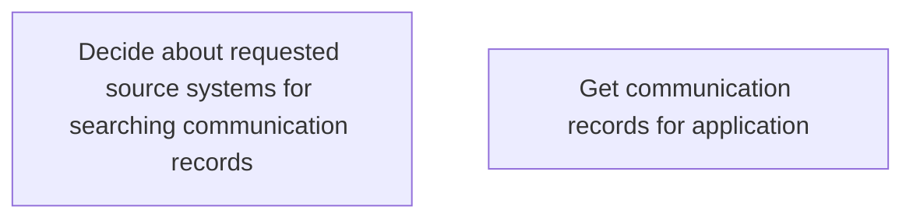

# Operations with communication records

```mermaid
graph TD
    Decide_about_requested_source_systems_for_searching_communic["Decide about requested source systems for searching communication records"]
    Get_communication_records_for_application["Get communication records for application"]
```
