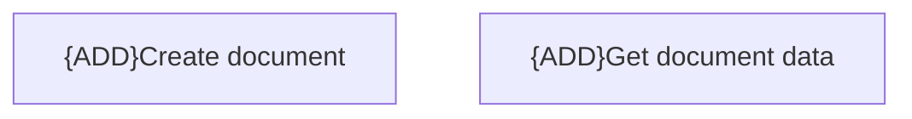

# Operations with documents

- **Diagram Type**: Custom
- **Package**: HomerSelect/BSL/Analysis Model/Contract Origination/COMMON for Contract origination/Business Rules/Operations with documents
- **Diagram ID**: 164384
- **Elements**: 2
- **Connectors**: 0

