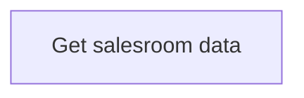

# Operations with salesrooms

- **Diagram Type**: Custom
- **Package**: HomerSelect/BSL/Analysis Model/Contract Origination/COMMON for Contract origination/Business Rules/Operations with salesrooms
- **Diagram ID**: 164386
- **Elements**: 1
- **Connectors**: 0

