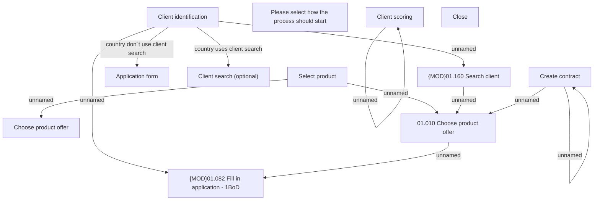

# Create contract

- **Diagram Type**: Custom
- **Package**: HomerSelect/BSL/Analysis Model/Contract Origination/COMMON for Contract origination/User Interface Model
- **Diagram ID**: 121898
- **Elements**: 14
- **Connectors**: 11

