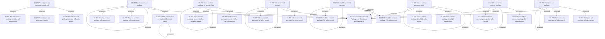

# Access Rights

```mermaid
graph TD
    n_01_281_Record_contract_package_mistake_v2["01.281 Record contract package mistake v2"]
    n_01_281_Record_contract_package_mistake_all_sales_areas["01.281 Record contract package mistake (all sales areas)"]
    n_01_281_Record_contract_package_mistake_all_salesrooms["01.281 Record contract package mistake (all salesrooms)"]
    n_01_281_Record_contract_package_mistake["01.281 Record contract package mistake"]
    n_01_200_Add_to_contract_package_all_sales_areas["01.200 Add to contract package (all sales areas)"]
    n_01_265_Receive_contract_package_all_sales_areas["01.265 Receive contract package (all sales areas)"]
    n_01_260_Send_contract_package_to_central_office_all_sales_a["01.260 Send contract package to central office (all sales areas)"]
    n_01_250_Print_contract_package_all_sales_areas["01.250 Print contract package (all sales areas)"]
    n_01_240_Remove_from_contract_package_all_sales_areas["01.240 Remove from contract package (all sales areas)"]
    n_01_230_Show_contract_package_detail_all_sales_areas["01.230 Show contract package detail (all sales areas)"]
    n_01_220_Search_for_contract_package_all_sales_areas["01.220 Search for contract package (all sales areas)"]
    n_01_266_Check_presence_of_contract_with_barcode_reader["01.266 Check presence of contract with barcode reader"]
    n_01_266_Check_presence_of_contract_with_barcode_reader["01.266 Check presence of contract with barcode reader"]
    n_01_265_Receive_contract_package_all_salesrooms["01.265 Receive contract package (all salesrooms)"]
    n_01_260_Send_contract_package_to_central_office_all_salesro["01.260 Send contract package to central office (all salesrooms)"]
    n_01_250_Print_contract_package_all_salesrooms["01.250 Print contract package (all salesrooms)"]
    n_01_240_Remove_from_contract_package_all_salesrooms["01.240 Remove from contract package (all salesrooms)"]
    n_01_230_Show_contract_package_detail_all_salesrooms["01.230 Show contract package detail (all salesrooms)"]
    n_01_220_Search_for_contract_package_all_salesrooms["01.220 Search for contract package (all salesrooms)"]
    n_01_200_Add_to_contract_package_all_salesrooms["01.200 Add to contract package (all salesrooms)"]
    Access_control_to_Contract_Packages_by_Salesroom_and_Sales_a["Access control to Contract Packages by Salesroom and Sales area"]
    n_01_265_Receive_contract_package["01.265 Receive contract package"]
    n_01_260_Send_contract_package_to_central_office["01.260 Send contract package to central office"]
    n_01_250_Print_contract_package["01.250 Print contract package"]
    n_01_240_Remove_from_contract_package["01.240 Remove from contract package"]
    n_01_230_Show_contract_package_detail["01.230 Show contract package detail"]
    n_01_220_Search_for_contract_package["01.220 Search for contract package"]
    n_01_200_Add_to_contract_package["01.200 Add to contract package"]
    n_01_265_Receive_contract_package["01.265 Receive contract package"]
    n_01_260_Send_contract_package_to_central_office["01.260 Send contract package to central office"]
    n_01_250_Print_contract_package["01.250 Print contract package"]
    n_01_240_Remove_from_contract_package["01.240 Remove from contract package"]
    n_01_230_Show_contract_package_detail["01.230 Show contract package detail"]
    n_01_220_Search_for_contract_package["01.220 Search for contract package"]
    n_01_200_Add_to_contract_package["01.200 Add to contract package"]
    n_01_265_Receive_contract_package -->|unnamed| n_01_266_Check_presence_of_contract_with_barcode_reader
    n_01_266_Check_presence_of_contract_with_barcode_reader -->|unnamed| n_01_266_Check_presence_of_contract_with_barcode_reader
    n_01_265_Receive_contract_package -->|unnamed| Access_control_to_Contract_Packages_by_Salesroom_and_Sales_a
    n_01_265_Receive_contract_package -->|unnamed| n_01_265_Receive_contract_package
    n_01_265_Receive_contract_package -->|unnamed| n_01_265_Receive_contract_package_all_sales_areas
    n_01_265_Receive_contract_package -->|unnamed| n_01_265_Receive_contract_package_all_salesrooms
    n_01_260_Send_contract_package_to_central_office -->|unnamed| n_01_260_Send_contract_package_to_central_office_all_salesro
    n_01_260_Send_contract_package_to_central_office -->|unnamed| n_01_260_Send_contract_package_to_central_office
    n_01_260_Send_contract_package_to_central_office -->|unnamed| Access_control_to_Contract_Packages_by_Salesroom_and_Sales_a
    n_01_260_Send_contract_package_to_central_office -->|unnamed| n_01_260_Send_contract_package_to_central_office_all_sales_a
    n_01_200_Add_to_contract_package -->|unnamed| n_01_200_Add_to_contract_package_all_salesrooms
    n_01_200_Add_to_contract_package -->|unnamed| Access_control_to_Contract_Packages_by_Salesroom_and_Sales_a
    n_01_200_Add_to_contract_package -->|unnamed| n_01_200_Add_to_contract_package
    n_01_200_Add_to_contract_package -->|unnamed| n_01_200_Add_to_contract_package_all_sales_areas
    n_01_220_Search_for_contract_package -->|unnamed| Access_control_to_Contract_Packages_by_Salesroom_and_Sales_a
    n_01_220_Search_for_contract_package -->|unnamed| n_01_220_Search_for_contract_package_all_salesrooms
    n_01_220_Search_for_contract_package -->|unnamed| n_01_220_Search_for_contract_package
    n_01_220_Search_for_contract_package -->|unnamed| n_01_220_Search_for_contract_package_all_sales_areas
    n_01_230_Show_contract_package_detail -->|unnamed| n_01_230_Show_contract_package_detail
    n_01_230_Show_contract_package_detail -->|unnamed| n_01_230_Show_contract_package_detail_all_salesrooms
    n_01_230_Show_contract_package_detail -->|unnamed| n_01_230_Show_contract_package_detail_all_sales_areas
    n_01_230_Show_contract_package_detail -->|unnamed| Access_control_to_Contract_Packages_by_Salesroom_and_Sales_a
    n_01_281_Record_contract_package_mistake_v2 -->|unnamed| n_01_281_Record_contract_package_mistake_all_sales_areas
    n_01_281_Record_contract_package_mistake_v2 -->|unnamed| n_01_281_Record_contract_package_mistake
    n_01_281_Record_contract_package_mistake_v2 -->|unnamed| n_01_281_Record_contract_package_mistake_all_salesrooms
    n_01_240_Remove_from_contract_package -->|unnamed| n_01_240_Remove_from_contract_package_all_salesrooms
    n_01_240_Remove_from_contract_package -->|unnamed| n_01_240_Remove_from_contract_package
    n_01_240_Remove_from_contract_package -->|unnamed| Access_control_to_Contract_Packages_by_Salesroom_and_Sales_a
    n_01_240_Remove_from_contract_package -->|unnamed| n_01_240_Remove_from_contract_package_all_sales_areas
    n_01_250_Print_contract_package -->|unnamed| n_01_250_Print_contract_package_all_sales_areas
    n_01_250_Print_contract_package -->|unnamed| n_01_250_Print_contract_package_all_salesrooms
    n_01_250_Print_contract_package -->|unnamed| Access_control_to_Contract_Packages_by_Salesroom_and_Sales_a
    n_01_250_Print_contract_package -->|unnamed| n_01_250_Print_contract_package
```
