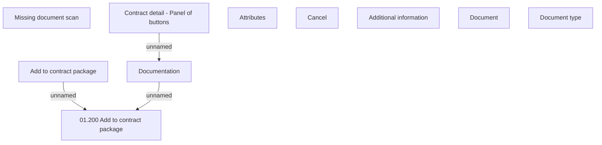

# Add to contract package

```mermaid
graph TD
    Missing_document_scan["Missing document scan"]
    Contract_detail_Panel_of_buttons["Contract detail - Panel of buttons"]
    Attributes["Attributes"]
    n_01_200_Add_to_contract_package["01.200 Add to contract package"]
    Cancel["Cancel"]
    Add_to_contract_package["Add to contract package"]
    Additional_information["Additional information"]
    Document["Document"]
    Document_type["Document type"]
    Documentation["Documentation"]
    Contract_detail_Panel_of_buttons -->|unnamed| Documentation
    Add_to_contract_package -->|unnamed| n_01_200_Add_to_contract_package
    Documentation -->|unnamed| n_01_200_Add_to_contract_package
```
