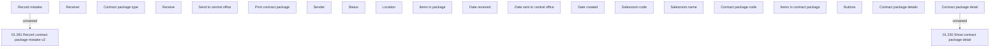

# Contract package detail

```mermaid
graph TD
    n_01_281_Record_contract_package_mistake_v2["01.281 Record contract package mistake v2"]
    n_01_230_Show_contract_package_detail["01.230 Show contract package detail"]
    Record_mistake["Record mistake"]
    Receiver["Receiver"]
    Contract_package_type["Contract package type"]
    Receive["Receive"]
    Send_to_central_office["Send to central office"]
    Print_contract_package["Print contract package"]
    Sender["Sender"]
    Status["Status"]
    Location["Location"]
    Items_in_package["Items in package"]
    Date_received["Date received"]
    Date_sent_to_central_office["Date sent to central office"]
    Date_created["Date created"]
    Salesroom_code["Salesroom code"]
    Salesroom_name["Salesroom name"]
    Contract_package_code["Contract package code"]
    Items_in_contract_package["Items in contract package"]
    Buttons["Buttons"]
    Contract_package_details["Contract package details"]
    Contract_package_detail["Contract package detail"]
    Record_mistake -->|unnamed| n_01_281_Record_contract_package_mistake_v2
    Contract_package_detail -->|unnamed| n_01_230_Show_contract_package_detail
```
