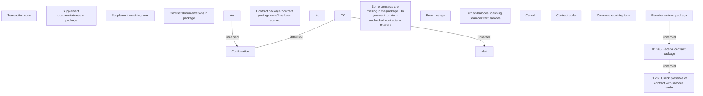

# Receive contract package

```mermaid
graph TD
    Transaction_code["Transaction code"]
    Supplement_documentationss_in_package["Supplement documentationss in package"]
    Supplement_receiving_form["Supplement receiving form"]
    Contract_documentations_in_package["Contract documentations in package"]
    OK["OK"]
    Contract_package_contract_package_code_has_been_received["Contract package 'contract package code' has been received."]
    Confirmation["Confirmation"]
    No["No"]
    Yes["Yes"]
    Some_contracts_are_missing_in_the_package_Do_you_want_to_ret["Some contracts are missing in the package. Do you want to return unchecked contracts to retailer?"]
    Alert["Alert"]
    Error_mesage["Error mesage"]
    n_01_266_Check_presence_of_contract_with_barcode_reader["01.266 Check presence of contract with barcode reader"]
    Turn_on_barcode_scanning_Scan_contract_barcode["Turn on barcode scanning / Scan contract barcode "]
    n_01_265_Receive_contract_package["01.265 Receive contract package"]
    Cancel["Cancel"]
    OK["OK"]
    Contract_code["Contract code"]
    Contracts_receiving_form["Contracts receiving form"]
    Receive_contract_package["Receive contract package"]
    Receive_contract_package -->|unnamed| n_01_265_Receive_contract_package
    OK -->|unnamed| Alert
    Yes -->|unnamed| Confirmation
    OK -->|unnamed| Confirmation
    n_01_265_Receive_contract_package -->|unnamed| n_01_266_Check_presence_of_contract_with_barcode_reader
```
