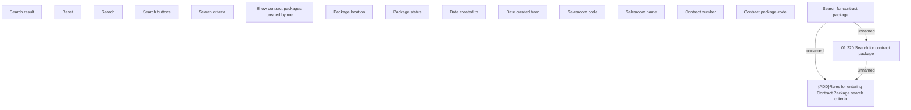

# Search for contract package

- **Diagram Type**: Custom
- **Package**: HomerSelect/BSL/Analysis Model/Contract Origination/Contract package tracking/User Interface Model
- **Diagram ID**: 142417
- **Elements**: 17
- **Connectors**: 3

