# Access Rights

- **Diagram Type**: Custom
- **Package**: HomerSelect/BSL/Analysis Model/Contract Origination/Contract signing/Access Rights
- **Diagram ID**: 157452
- **Elements**: 21
- **Connectors**: 15

```mermaid
graph TD
    n_01_182_Prepare_documentation_to_sign_all_applications["01.182 Prepare documentation to sign - all applications"]
    ADD_01_191_Process_installment_schedule_generation["{ADD}01.191 Process installment schedule generation"]
    MOD_01_191_Process_installment_schedule_generation_after_dis["{MOD}01.191 Process installment schedule generation after disbursement"]
    ADD_01_186_Prepare_documentation["{ADD}01.186 Prepare documentation"]
    n_01_187_Sign_contract["01.187 Sign contract"]
    MOD_01_187_Sign_contract["{MOD}01.187 Sign contract"]
    MOD_01_186_Prepare_documentation["{MOD}01.186 Prepare documentation"]
    n_01_189_Print_client_s_documents["01.189 Print client's documents"]
    n_01_189_Print_client_s_documents["01.189 Print client's documents"]
    n_01_180_Sign_contract_with_invalid_documents["01.180 Sign contract (with invalid documents)"]
    n_01_185_Validate_card_number["01.185 Validate card number"]
    n_01_185_Validate_card_number["01.185 Validate card number"]
    n_01_183_Print_documents_for_contract_sign["01.183 Print documents for contract sign"]
    MOD_01_183_Print_documents_for_contract_sign["{MOD}01.183 Print documents for contract sign"]
    n_01_182_Prepare_documentation_to_sign["01.182 Prepare documentation to sign"]
    n_01_182_Prepare_documentation_manually["01.182 Prepare documentation manually"]
    n_01_180_Sign_contract_back_office["01.180 Sign contract (back office)"]
    n_01_180_Sign_contract_all_salesrooms["01.180 Sign contract (all salesrooms)"]
    n_01_180_Sign_contract_manually["01.180 Sign contract manually"]
    Access_control_to_Contract_by_Salesroom["Access control to Contract by Salesroom"]
    n_01_180_Sign_contract_manually["01.180 Sign contract manually"]
    n_01_180_Sign_contract_manually -->|unnamed| n_01_180_Sign_contract_all_salesrooms
    n_01_180_Sign_contract_manually -->|unnamed| n_01_180_Sign_contract_with_invalid_documents
    n_01_180_Sign_contract_manually -->|unnamed| n_01_180_Sign_contract_back_office
    n_01_180_Sign_contract_manually -->|unnamed| n_01_180_Sign_contract_manually
    n_01_180_Sign_contract_manually -->|unnamed| MOD_01_187_Sign_contract
    n_01_180_Sign_contract_manually -->|unnamed| Access_control_to_Contract_by_Salesroom
    n_01_185_Validate_card_number -->|unnamed| n_01_185_Validate_card_number
    MOD_01_187_Sign_contract -->|unnamed| n_01_187_Sign_contract
    n_01_182_Prepare_documentation_manually -->|unnamed| MOD_01_186_Prepare_documentation
    MOD_01_186_Prepare_documentation -->|unnamed| ADD_01_186_Prepare_documentation
    MOD_01_183_Print_documents_for_contract_sign -->|unnamed| n_01_183_Print_documents_for_contract_sign
    n_01_182_Prepare_documentation_manually -->|unnamed| n_01_182_Prepare_documentation_to_sign_all_applications
    n_01_182_Prepare_documentation_manually -->|unnamed| n_01_182_Prepare_documentation_to_sign
    n_01_189_Print_client_s_documents -->|unnamed| n_01_189_Print_client_s_documents
    MOD_01_191_Process_installment_schedule_generation_after_dis -->|unnamed| ADD_01_191_Process_installment_schedule_generation
```

