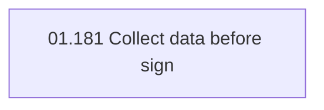

# Access Rights

- **Diagram Type**: Custom
- **Package**: HomerSelect/BSL/Analysis Model/Contract Origination/Contract signing/Collect data before sign/Access Rights
- **Diagram ID**: 111686
- **Elements**: 1
- **Connectors**: 0

