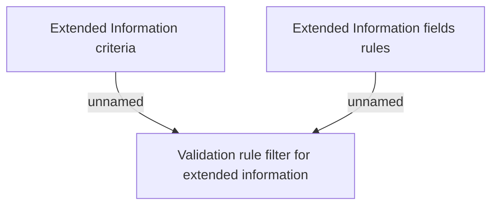

# IN

- **Diagram Type**: Custom
- **Package**: HomerSelect/BSL/Analysis Model/Contract Origination/Contract signing/Collect data before sign/Business Rules
- **Diagram ID**: 111696
- **Elements**: 3
- **Connectors**: 2

