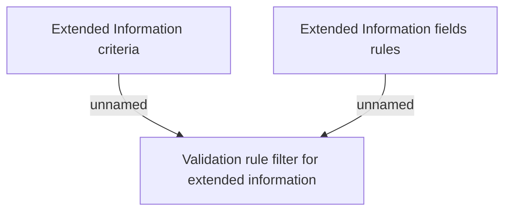

# IN

```mermaid
graph TD
    Validation_rule_filter_for_extended_information["Validation rule filter for extended information"]
    Extended_Information_criteria["Extended Information criteria"]
    Extended_Information_fields_rules["Extended Information fields rules"]
    Extended_Information_criteria -->|unnamed| Validation_rule_filter_for_extended_information
    Extended_Information_fields_rules -->|unnamed| Validation_rule_filter_for_extended_information
```
