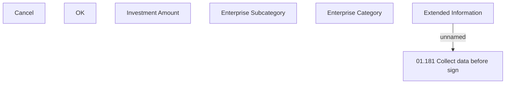

# Extended Information - IN

```mermaid
graph TD
    n_01_181_Collect_data_before_sign["01.181 Collect data before sign"]
    Cancel["Cancel"]
    OK["OK"]
    Investment_Amount["Investment Amount"]
    Enterprise_Subcategory["Enterprise Subcategory"]
    Enterprise_Category["Enterprise Category"]
    Extended_Information["Extended Information"]
    Extended_Information -->|unnamed| n_01_181_Collect_data_before_sign
```
