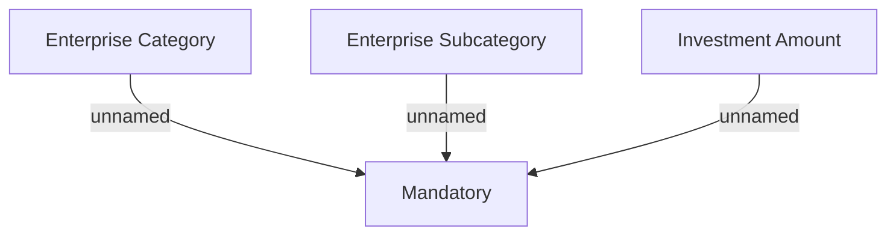

# Validation Rules - IN

- **Diagram Type**: Custom
- **Package**: HomerSelect/BSL/Analysis Model/Contract Origination/Contract signing/Collect data before sign/Validation Rules
- **Diagram ID**: 111689
- **Elements**: 4
- **Connectors**: 3

