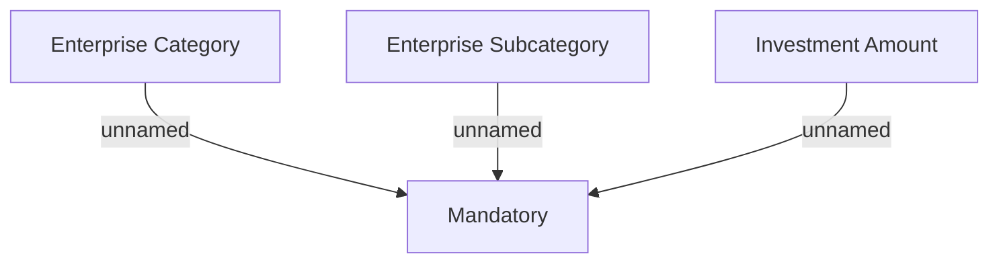

# Validation Rules - IN

```mermaid
graph TD
    Enterprise_Category["Enterprise Category"]
    Mandatory["Mandatory"]
    Enterprise_Subcategory["Enterprise Subcategory"]
    Investment_Amount["Investment Amount"]
    Enterprise_Category -->|unnamed| Mandatory
    Enterprise_Subcategory -->|unnamed| Mandatory
    Investment_Amount -->|unnamed| Mandatory
```
