# Contract signing

- **Diagram Type**: Custom
- **Package**: HomerSelect/BSL/Analysis Model/Contract Origination/Contract signing/User Interface Model
- **Diagram ID**: 158093
- **Elements**: 41
- **Connectors**: 14

```mermaid
graph TD
    Verify_code["Verify code"]
    Verification_contact["Verification contact"]
    Verification_code["Verification code"]
    Result["Result"]
    Generate_verification_code["Generate verification code"]
    Countdown["Countdown"]
    OTP_verification_for_common_contract_signing["OTP verification (for common contract signing)"]
    DEL_Electronic_signature_component["{DEL}Electronic signature component"]
    Selected_contracts["Selected contracts"]
    Signed_Contracts["Signed Contracts"]
    External_Reference["External Reference"]
    Contract_number["Contract number"]
    Contract_status["Contract status"]
    MOD_Client_full_name["{MOD}Client full name"]
    Preparation_info["Preparation info"]
    Contract_is_signed["Contract is signed"]
    Other_info["Other info"]
    Print_documentation["Print documentation"]
    Validate_card_number["Validate card number"]
    Card_number["Card number"]
    MOD_Application_detail["{MOD}Application detail"]
    Print_client_s_documents["Print client's documents"]
    Assigned_card["Assigned card"]
    n_01_149_Generate_verification_code_for_client_s_documentati["01.149 Generate verification code for client's documentation"]
    Sign_contracts["Sign contracts"]
    n_01_148_Validate_verification_code_for_client_s_documentati["01.148 Validate verification code for client's documentation"]
    n_01_189_Print_client_s_documents["01.189 Print client's documents"]
    Contract_detail["Contract detail"]
    Contract_detail_Panel_of_buttons["Contract detail - Panel of buttons"]
    n_01_185_Validate_card_number["01.185 Validate card number"]
    Cancel["Cancel"]
    Sign_contract["Sign contract"]
    Signed_on_back_office["Signed on back office"]
    Contract_signed_on_back_office["Contract signed on back office?"]
    n_01_180_Sign_contract_manually["01.180 Sign contract manually"]
    n_01_182_Prepare_documentation_manually["01.182 Prepare documentation manually"]
    Sign_contract["Sign contract"]
    Prepare_materials["Prepare materials"]
    Buttons["Buttons"]
    Contracts_to_sign["Contracts to sign"]
    Sign_contracts["Sign contracts"]
    Sign_contracts -->|unnamed| n_01_180_Sign_contract_manually
    Prepare_materials -->|unnamed| n_01_182_Prepare_documentation_manually
    Sign_contract -->|unnamed| Contract_signed_on_back_office
    Sign_contract -->|unnamed| n_01_180_Sign_contract_manually
    Contract_signed_on_back_office -->|unnamed| n_01_180_Sign_contract_manually
    Contract_detail_Panel_of_buttons -->|unnamed| Sign_contracts
    Print_client_s_documents -->|unnamed| n_01_189_Print_client_s_documents
    MOD_Application_detail -->|unnamed| Contract_detail
    Validate_card_number -->|unnamed| n_01_185_Validate_card_number
    Signed_Contracts -->|unnamed| Contract_detail
    Generate_verification_code -->|unnamed| n_01_149_Generate_verification_code_for_client_s_documentati
    Verify_code -->|unnamed| n_01_148_Validate_verification_code_for_client_s_documentati
    External_Reference -->|External Reference| n_01_180_Sign_contract_manually
    n_01_148_Validate_verification_code_for_client_s_documentati -->|unnamed| n_01_180_Sign_contract_manually
```

