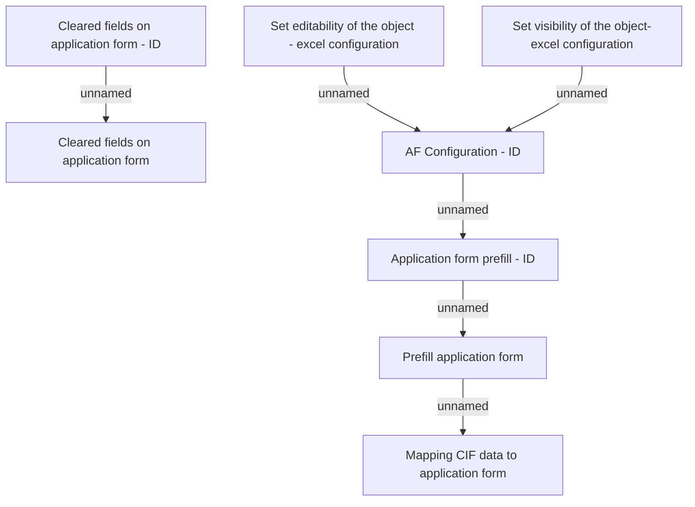

# AF definition - ID

- **Diagram Type**: Custom
- **Package**: HomerSelect/BSL/Analysis Model/Contract Origination/Fill in application/COMMON for Fill in application/Business Rules/ID
- **Diagram ID**: 148791
- **Elements**: 8
- **Connectors**: 6

