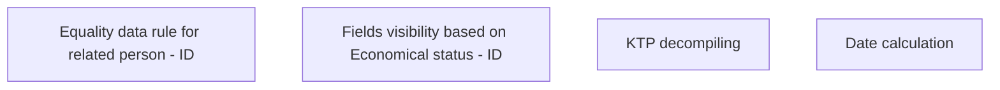

# Business rules ID

```mermaid
graph TD
    Equality_data_rule_for_related_person_ID["Equality data rule for related person - ID"]
    Fields_visibility_based_on_Economical_status_ID["Fields visibility based on Economical status - ID"]
    KTP_decompiling["KTP decompiling"]
    Date_calculation["Date calculation"]
```
