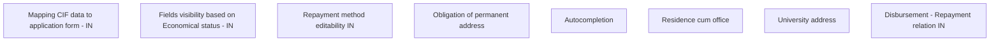

# IN - Business rules

```mermaid
graph TD
    Mapping_CIF_data_to_application_form_IN["Mapping CIF data to application form - IN"]
    Fields_visibility_based_on_Economical_status_IN["Fields visibility based on Economical status - IN"]
    Repayment_method_editability_IN["Repayment method editability IN"]
    Obligation_of_permanent_address["Obligation of permanent address"]
    Autocompletion["Autocompletion"]
    Residence_cum_office["Residence cum office"]
    University_address["University address"]
    Disbursement_Repayment_relation_IN["Disbursement - Repayment relation IN"]
```
