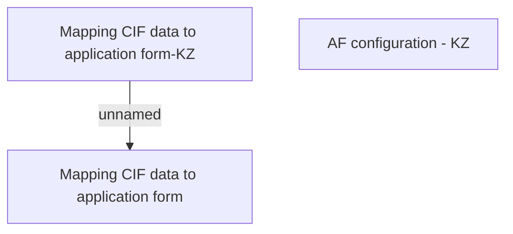

# AF definition - KZ

- **Diagram Type**: Custom
- **Package**: HomerSelect/BSL/Analysis Model/Contract Origination/Fill in application/COMMON for Fill in application/Business Rules/KZ
- **Diagram ID**: 118225
- **Elements**: 3
- **Connectors**: 1

