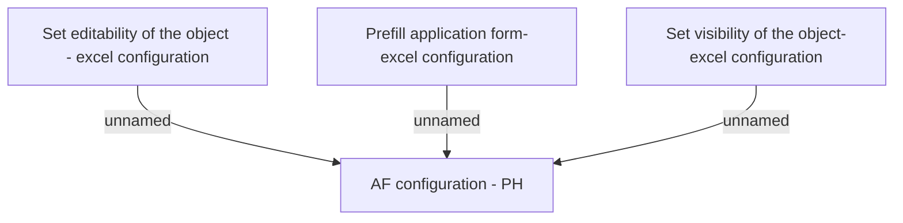

# AF definition - PH

- **Diagram Type**: Custom
- **Package**: HomerSelect/BSL/Analysis Model/Contract Origination/Fill in application/COMMON for Fill in application/Business Rules/PH
- **Diagram ID**: 157666
- **Elements**: 4
- **Connectors**: 3

