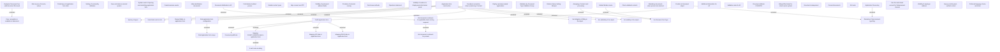

# Product business rules

```mermaid
graph TD
    Evaluate_if_document_has_valid_document_file_saved["Evaluate if document has valid document file saved"]
    Get_document_containers_for_product["Get document containers for product"]
    Main_source_of_income_values["Main source of income values"]
    Mask_fields_rule_for_AUI["Mask fields rule for AUI"]
    Partial_save_of_application_form_data["Partial save of application form data"]
    Setting_of_commodity_attributes["Setting of commodity attributes"]
    Save_card_data_to_external_system["Save card data to external system"]
    System_event_of_opening_and_submitting_application_form["System event of opening and submitting application form"]
    Create_business_events["Create business events"]
    Find_Application_form_scope["Find Application form scope"]
    Face_recognition_is_enabled_on_salesroom["Face recognition is enabled on salesroom"]
    Hide_identification_documents["Hide identification documents"]
    Cleared_fields_on_application_form["Cleared fields on application form"]
    Get_document_containers_for_applicable_client_scoring_segmen["Get document containers for applicable client scoring segment"]
    Document_prefill_rule["Document prefill rule"]
    Assigning_of_instant_card_processing["Assigning of instant card processing"]
    Find_identical_related_person["Find identical related person"]
    Disable_contact_types["Disable contact types"]
    Sign_consent_via_OTP["Sign consent via OTP"]
    Visibility_of_permanent_address_fields["Visibility of permanent address fields"]
    Providers_of_external_scoring["Providers of external scoring"]
    Card_issue_methods["Card issue methods"]
    Mapping_CLIENT_SEARCH_data_to_application_form["Mapping CLIENT_SEARCH data to application form"]
    Mapping_PAYM_data_to_application_form["Mapping PAYM data to application form"]
    Paperless_salesroom["Paperless salesroom"]
    Visibility_of_sections_in_Employment_information_panel["Visibility of sections in Employment information panel"]
    Application_Processing["Application Processing"]
    Find_application_form_configuration["Find application form configuration"]
    Facebook_connection_driven_re_storing_of_contact["Facebook connection driven (re)storing of contact"]
    Display_remotely_created_applications["Display remotely created applications"]
    Mystery_shopper["Mystery shopper"]
    Validation_by_Document_Type_Validation_Group["Validation by Document Type Validation Group "]
    Get_Renewal_Card_Type["Get Renewal Card Type"]
    Emboss_Name_Setting_Allowed["Emboss Name Setting Allowed"]
    Default_Emboss_name["Default Emboss name"]
    Mapping_CIF_data_to_application_form["Mapping CIF data to application form"]
    Prefill_application_form["Prefill application form"]
    Set_obligation_of_filling_in_the_object["Set obligation of filling in the object"]
    Set_editability_of_the_object["Set editability of the object"]
    Set_visibility_of_the_object["Set visibility of the object"]
    Application_form_construction["Application form construction"]
    X_sell_code_encoding["X-sell code encoding"]
    Check_validated_contacts["Check validated contacts"]
    Mandatory_documents_when_product_not_selected["Mandatory documents when product not selected"]
    Creation_of_document_object["Creation of document object"]
    Additional_information_for_AF["Additional information for AF"]
    Validation_rules_for_AF["Validation rules for AF"]
    Determine_Check_moment_type_flag["Determine Check moment type flag"]
    Document_attribute_COUNTRY["Document attribute COUNTRY"]
    Allowed_file_format_for_client_s_photo_upload["Allowed file format for client's photo upload"]
    Document_management["Document management"]
    Consent_documents["Consent documents"]
    GUI_rules["GUI rules"]
    Document_distribution_in_AF["Document distribution in AF"]
    Use_the_same_bank_account_for_Disbursement_channel["Use the same bank account for Disbursement channel"]
    Visibility_of_employer_address["Visibility of employer address"]
    Queue_control_panel_verified_contact["Queue control panel - verified contact"]
    Preferred_language_choice_restriction["Preferred language choice restriction"]
    Application_form_construction -->|unnamed| Mystery_shopper
    Application_form_construction -->|unnamed| Mask_fields_rule_for_AUI
    Find_application_form_configuration -->|unnamed| Find_Application_form_scope
    Evaluate_if_document_has_valid_document_file_saved -->|unnamed| Face_recognition_is_enabled_on_salesroom
    Application_form_construction -->|unnamed| Cleared_fields_on_application_form
    Document_distribution_in_AF -->|unnamed| Get_document_containers_for_applicable_client_scoring_segmen
    Creation_of_document_object -->|unnamed| Get_document_containers_for_applicable_client_scoring_segmen
    Prefill_application_form -->|unnamed| Document_prefill_rule
    Prefill_application_form -->|unnamed| Mapping_CLIENT_SEARCH_data_to_application_form
    Get_document_containers_for_applicable_client_scoring_segmen -->|unnamed| Get_document_containers_for_product
    Application_form_construction -->|unnamed| Find_application_form_configuration
    Creation_of_document_object -->|unnamed| Determine_Check_moment_type_flag
    Assigning_of_instant_card_processing -->|unnamed| Get_Renewal_Card_Type
    Default_Emboss_name -->|unnamed| Get_Renewal_Card_Type
    Prefill_application_form -->|unnamed| Mapping_CIF_data_to_application_form
    Application_form_construction -->|unnamed| Prefill_application_form
    Application_form_construction -->|unnamed| Set_obligation_of_filling_in_the_object
    Application_form_construction -->|unnamed| Set_editability_of_the_object
    Application_form_construction -->|unnamed| Set_visibility_of_the_object
    Mapping_CLIENT_SEARCH_data_to_application_form -->|unnamed| X_sell_code_encoding
    Application_Processing -->|unnamed| Determine_Check_moment_type_flag
    Prefill_application_form -->|unnamed| Mapping_PAYM_data_to_application_form
```
